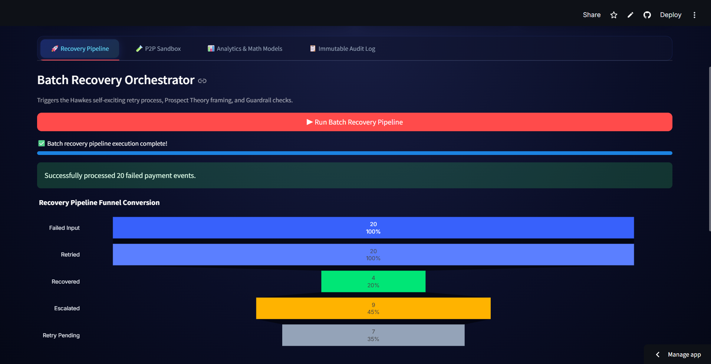
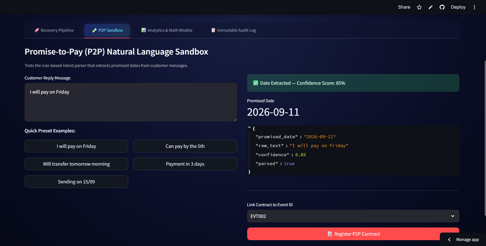
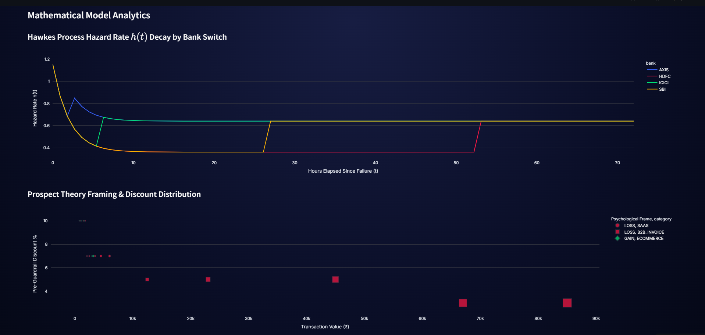
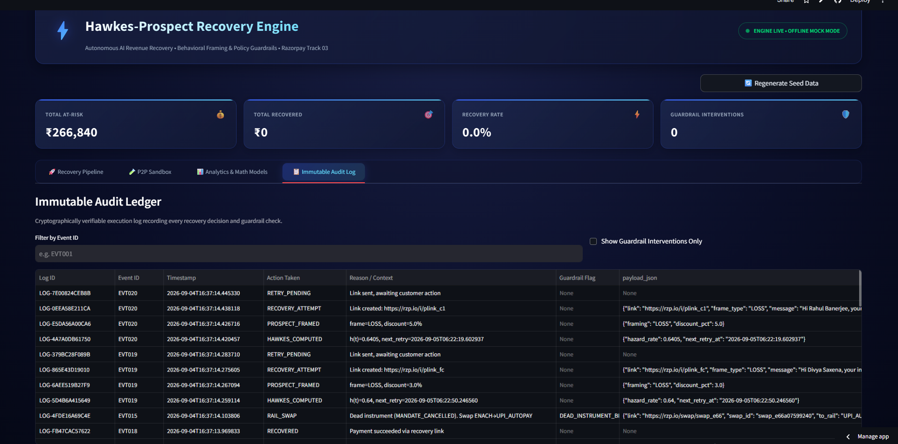

# ⚡ Razorpay Hawkes-Prospect Recovery Engine

> **Razorpay Internship Submission** — *Track 3: AI Revenue Recovery*

> An autonomous, self-healing payment recovery system combining **Hawkes Point-Process hazard modeling** with **Prospect Theory behavioral framing** to optimize payment retry timing, channel selection, and customer messaging.

---

## 📌 Executive Summary

Traditional payment retry systems suffer from three fundamental flaws:
1. **Blind Retry Storms**: Retrying failed transactions at static intervals ignores bank outage clusters, causing cascade failures and unnecessary processing fees.
2. **One-Size-Fits-All Outreach**: Generic notification templates fail to account for behavioral loss aversion versus gain-seeking motives across different customer segments.
3. **Futile Retries on Dead Instruments**: Attempting re-debits on cancelled mandates or expired cards degrades customer trust and yields 0% recovery.

The **Hawkes-Prospect Recovery Engine** resolves these inefficiencies through a closed-loop, mathematically optimized pipeline. It dynamically schedules retries based on real-time bank switch health, crafts psychological nudges tailored to merchant verticals, automatically swaps dead payment instruments, and enforces strict compliance guardrails via an immutable audit trail.

---
## 🎥 Video Walkthrough

[[Razorpay Recovery Engine Demo]](https://www.youtube.com/watch?v=WkYYQMz6X8Q)

*> 💡 **Click above to watch the full system demonstration on YouTube.***

## 📸 System Interface & Showcase

| View | Screenshot | Description |
| :--- | :---: | :--- |
| **01. Recovery Pipeline** |  | Real-time failure event queue, batch orchestration trigger, and live WhatsApp outreach preview. |
| **02. P2P Intent Sandbox** |  | Deterministic natural language extraction testing grounds for Promise-to-Pay customer messages. |
| **03. Mathematical Analytics** |  | Interactive Hawkes hazard rate decay curves and Prospect framing discount distributions. |
| **04. Audit Ledger** |  | Time-stamped, verifiable audit log tracking engine actions, policy blocks, and rail swaps. |


---

## 🏗 System Architecture

```
┌─────────────────────────────────────────────────────────────────┐
│                     Streamlit Dashboard (app.py)                │
│  ┌──────────┐  ┌──────────┐  ┌──────────┐  ┌───────────────┐  │
│  │ Pipeline │  │   P2P    │  │Analytics │  │  Audit Log    │  │
│  │   Tab    │  │ Sandbox  │  │   Tab    │  │    Tab        │  │
│  └────┬─────┘  └────┬─────┘  └────┬─────┘  └───────┬───────┘  │
└───────┼──────────────┼────────────┼─────────────────┼──────────┘
        │              │            │                 │
        ▼              ▼            │                 │
┌───────────────────────────────────┼─────────────────┼──────────┐
│              engine/              │                 │          │
│  ┌──────────┐  ┌───────────┐     │                 │          │
│  │  Hawkes  │  │ Prospect  │     │                 │          │
│  │Scheduler │  │  Framer   │     │                 │          │
│  └────┬─────┘  └─────┬─────┘     │                 │          │
│       │              │           │                 │          │
│       ▼              ▼           │                 │          │
│  ┌──────────────────────────┐    │                 │          │
│  │     Guardrail Engine     │    │                 │          │
│  │  • 10% discount cap     │    │                 │          │
│  │  • 2 contacts/24h cap   │    │                 │          │
│  │  • Dead instrument block│    │                 │          │
│  └────────────┬─────────────┘    │                 │          │
│               │                  │                 │          │
│               ▼                  │                 │          │
│  ┌──────────────────────────┐    │                 │          │
│  │   Recovery Pipeline      │    │                 │          │
│  │  (orchestrates all)      │────┤                 │          │
│  └────────────┬─────────────┘    │                 │          │
└───────────────┼──────────────────┼─────────────────┼──────────┘
                │                  │                 │
        ┌───────┴───────┐         │                 │
        ▼               ▼         │                 │
┌──────────────┐ ┌────────────┐   │                 │
│ Razorpay Mock│ │ Rail Swap  │   │                 │
│ (Payment &   │ │ Service    │   │                 │
│  EMI Links)  │ │            │   │                 │
└──────────────┘ └────────────┘   │                 │
                                  │                 │
                    ┌─────────────┴─────────────────┘
                    ▼
           ┌─────────────────┐
           │   SQLite (WAL)  │
           │  • failure_events│
           │  • hawkes_metrics│
           │  • p2p_contracts │
           │  • audit_log     │
           └─────────────────┘
```

---

## 🔬 Core Mathematical & Algorithmic Modules

### 1. Hawkes Self-Exciting Point Process (Optimal Retry Timing)
Payment failures clustered around specific bank switches (e.g., HDFC, SBI) exhibit self-exciting characteristics. The instantaneous hazard rate $h(t)$ determines the probability of success when scheduling a retry at time $t$:

$$h(t) = \mu_0 + \sum_{t_i < t} \alpha \cdot e^{-\beta (t - t_i)} + \gamma \cdot S_{\text{payroll}}(t)$$

* **$\mu_0$ (Baseline Hazard)**: Standard baseline probability of payment authorization ($0.30$).
* **$\alpha$ (Excitation Amplitude)**: Magnitude of spike in failure risk when recent switch errors occur ($0.80$).
* **$\beta$ (Exponential Decay Rate)**: Speed at which bank outage noise dissipates ($0.50$).
* **$\gamma \cdot S_{\text{payroll}}(t)$ (Payroll Cycle Weight)**: Modulate hazard based on liquidity windows. Returns $0.85\text{--}0.90$ during monthly salary windows (28th to 5th) and drops to $0.15$ mid-month.

*The engine defers retries until $h(t) < 0.50$, avoiding retries during elevated failure clusters.*

### 2. Prospect Theory Framing (Behavioral Outreach)
Utilizes Kahneman & Tversky's Prospect Theory value function to maximize recovery conversion based on merchant category:

$$V(x) = \begin{cases} x^\alpha & \text{if } x \ge 0 \quad \text{(Gain Frame)} \\ -\lambda (-x)^\beta & \text{if } x < 0 \quad \text{(Loss Frame)} \end{cases}$$

* **Loss Frame ($\lambda = 2.25$)**: Applied to **SaaS & B2B Subscriptions**. Emphasizes loss aversion: *"Your account access will be suspended in 48 hours."*
* **Gain Frame ($\alpha = 0.88$)**: Applied to **E-Commerce & Retail**. Emphasizes positive utility: *"Complete payment now to secure your discount or switch to zero-cost EMI."*

### 3. Deterministic P2P (Promise-to-Pay) Intent Parser
A lightweight, zero-LLM regex parser that extracts binding future payment dates from unstructured customer replies without external API calls:
* `"I will pay on Friday"` $\rightarrow$ Next Friday timestamp ($\text{Confidence} = 85\%$)
* `"Will transfer tomorrow morning"` $\rightarrow$ Next day 09:00 AM ($\text{Confidence} = 95\%$)
* `"Paying on 15/09"` $\rightarrow$ Exact calendar date ($\text{Confidence} = 90\%$)

### 4. Policy Guardrails & Compliance System
Every automated decision passes through a deterministic policy layer before execution:
* **Discount Limit**: Maximum incentive capped at $10\%$.
* **Contact Frequency**: Maximum $2$ customer notifications per $24$-hour rolling window.
* **Dead Instrument Enforcement**: Error codes `EXPIRED_CARD` or `MANDATE_CANCELLED` automatically halt re-debit attempts and route to Rail Swap.


---

## 🛠 Tech Stack

| Domain | Tool / Library | Purpose |
| :--- | :--- | :--- |
| **Language** | Python 3.10+ | Core business logic & typing |
| **Frontend UI** | Streamlit | Responsive dashboard & live outreach preview |
| **Visualization** | Plotly Express & Graph Objects | Hazard curves, scatter matrices, and interactive charts |
| **Data Engine** | SQLite (WAL Mode) | Concurrency-safe, zero-config local persistence |

---

## Setup

```bash
# 1. Install dependencies
pip install -r requirements.txt

# 2. Run the app
streamlit run app.py
```

The app uses a local SQLite database (`recovery.db`) that is auto-created on first
run with 20 seed failure events. Click **"Regenerate Seed Data"** in the sidebar
to reset.


## Folder Structure

```
razorpay-recovery-engine/
├── app.py                   # Streamlit interactive dashboard UI
├── requirements.txt         # Project dependencies
├── recovery.db              # Auto-generated SQLite database (WAL mode)
├── assets/                  # Dashboard screenshots for documentation
│   ├── 01-recovery-pipeline.png
│   ├── 02-p2p-sandbox.png
│   ├── 03-mathematical-analytics.png
│   └── 04-audit-ledger.png
├── data/
│   ├── schema.py            # SQLite database schema definitions
│   ├── seed_data.py         # Deterministic seed data generator
│   └── database.py          # Database access layer
├── engine/
│   ├── hawkes.py            # Hawkes Point-Process scheduling engine
│   ├── prospect.py          # Prospect Theory behavioral framing engine
│   ├── p2p_parser.py        # Promise-to-Pay regex parser
│   ├── guardrails.py        # Policy guardrails & compliance rules
│   └── pipeline.py          # End-to-end recovery orchestrator
├── services/
│   ├── razorpay_mock.py     # Mocked payment link and EMI generation APIs
│   └── rail_swap.py         # Automated payment rail fallback service
└── utils/
    └── audit.py             # Time-stamped audit logging utility
```
